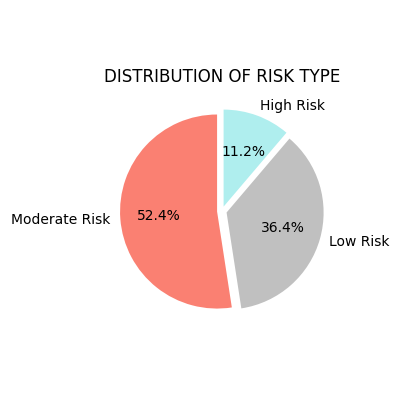

# HealthInsuranceDataUS

## Table of Contents
1. [Description](#description)
2. [Motivation](#motivation)
3. [Dataset](#dataset)
4. [Files in Repository](#files-in-repository)
5. [Features](#features)
6. [Installation](#installation)
7. [Usage](#usage)
8. [Visualizations & Images](#visualizations--images)
9. [Reports & Presentations](#reports--presentations)
10. [Acknowledgements](#acknowledgements)
11. [License](#license)

---

## Description
This repository explores the **U.S. Health Insurance dataset** through **data analytics and linear regression**.  
It includes:
- A Jupyter Notebook (`project_insurance_analysis.ipynb`)
- The raw dataset (`insurance.csv`)
- A PDF report and PowerPoint presentation
- A set of exported images and plots

---

## Motivation
Health insurance data reveals relationships between **age, BMI, number of children, smoking habits, and insurance costs**.  
This project demonstrates:
- Data cleaning
- Exploratory analysis
- Regression modeling
- Communicating results via slides, reports, and visuals

---

## Dataset
- **Source**: [Kaggle – US Health Insurance Dataset](https://www.kaggle.com/datasets/teertha/ushealthinsurancedataset/data)  
- **File**: `insurance.csv`  
- Contains demographic and lifestyle factors with insurance charges.  
- Key columns: `age`, `sex`, `bmi`, `children`, `smoker`, `region`, `charges`.

---

## Files in Repository
- `insurance.csv` → dataset  
- `project_insurance_analysis.ipynb` → Jupyter notebook with code & analysis  
- `Analysis of US Health Insurance data.pdf` → written report  
- `Analysis of US Health Insurance data.pptx` → presentation slides  
- `images/` → exported plots and figures  
- `README.md` → project description  

---

## Features
- Linear regression to predict insurance charges  
- Exploratory visualizations (BMI vs charges, smoker impact, region analysis)  
- Correlation and statistical insights  
- Reports and slides summarizing results  

---

## Installation
Clone the repo:
```bash
git clone https://github.com/BjoernMueller13/HealthInsuranceDataUS.git
cd HealthInsuranceDataUS
```

Install dependencies:
```bash
pip install pandas numpy matplotlib seaborn scikit-learn jupyter
```

---

## Usage
- Open the Jupyter Notebook:
```bash
jupyter notebook project_insurance_analysis.ipynb
```
- Run cells to reproduce analysis and plots  
- Review the PDF / PPTX for presentation of results  

---

## Reports & Presentations
The full results are also available as downloadable files:

- 📄 [Analysis of US Health Insurance data (PDF)](presentations/_Analysis%20of%20US%20Health%20Insurance%20data.pdf)  
- 📊 [Analysis of US Health Insurance data (PPTX)](presentations/_Analysis%20of%20US%20Health%20Insurance%20data.pptx)  

These documents provide a structured overview of methodology, findings, and conclusions.

---

## Visualizations & Images
The following images are included in the repository. Each one can be described in more detail:

*Distribution*
- Even distribution in age
- BMI: Gauss curve
- Charges: great left skew

*Outliers*
- 9 Outliers at BMI
- Over 100 Outliers at Charges

  
  

*Observation*
- Relatively even distribution between sex and region
- Uneven distribution between
  - Smokers
  - Children (w/ has a far higher concentration)

  
  

*Observation*
- No great variation of smokers by region
- Small outlier: Southeast

  

*Observation*
- Relatively even distribution of smokers at a certain sex
- Males slightly higher than females

  
   

*Observation*
Look on heatmap → lowest horizontal line
- Greatest impact by age and BMI
- Low impact by number of children

  
  

*Observation*
- Impact by sex is evenly distributed by male and female
- Age is a higher impact
  
  

*Observation*
- Critical impact by smoking
- Age has an impact, too
  
 

*Observation*
- Number of children has almost no impact until a number of 3
- Great decrease at 4 and 5 children
- Great impact by smoking
  
  

*Clustering of BMI according to current standards:*
- BMI > 18.5 → Underweight
- 18.5 < BMI < 25 → Normal Weight
- 25 =< BMI < 30 → Overweight
- 30 < BMI → Obesity

*Observation*
- High percentage of obesity and overweight
- Keep in mind: BMI one of the highest impacts on charges

  

*Observation*
- No underweight people in southeast
- Highest charges for obesity
- Tie 2nd highest charges for normal and overweight
  - Assumption: affect by smokers

  

*Clustering*
- Clustering to risk level:
  - High risk: Obesity + Smoker
  - Moderate risk: normal/overweight + smoker
  - Else: low risk
    
- Clustering by age:
  - Age < 30 years
  - 30 years < Age < 50 years
  - Age > 50 years

  

*Observations*
- Charges increase with risk level
- Age as greater impact

  

*KEY FINDINGS*
Findings (Data Distribution):

- Outliers:
  - BMI: 9
  - Charges: > 100 + Skew to the right

- More or less balanced distribution per
  - Age
  - Sex
  - Smokers
  - Region

Insights
- Smoking has a high impact on charges
- Also, obesity affects charges heavily
- Charges rise continuously per age
- Regional distribution of the factors including the sex mentioned above is relatively evenly done
- Low impact on charges by the number of children


*Linear Regression*
- Mean Squared Error: 0.285
- R-squared (R²) on Test Set: 0.715

   

---

## Acknowledgements
- Dataset: [Kaggle – US Health Insurance Dataset](https://www.kaggle.com/datasets/teertha/ushealthinsurancedataset/data)  
- Inspired by FreeCodeCamp guide on [writing good READMEs](https://www.freecodecamp.org/news/how-to-write-a-good-readme-file/)  

---

## License
MIT License – free to use, modify, and distribute.
